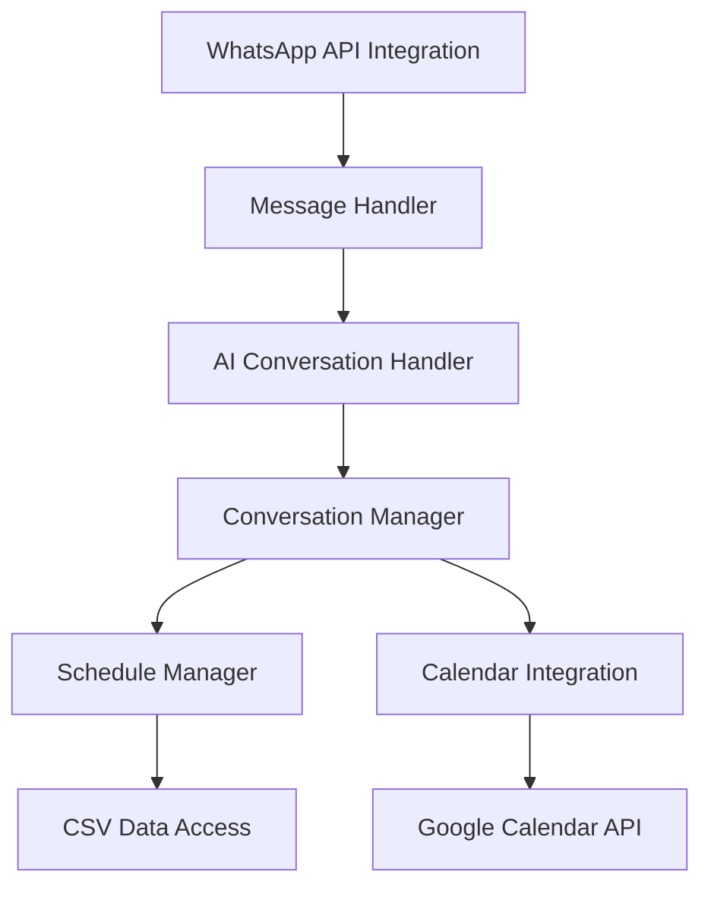
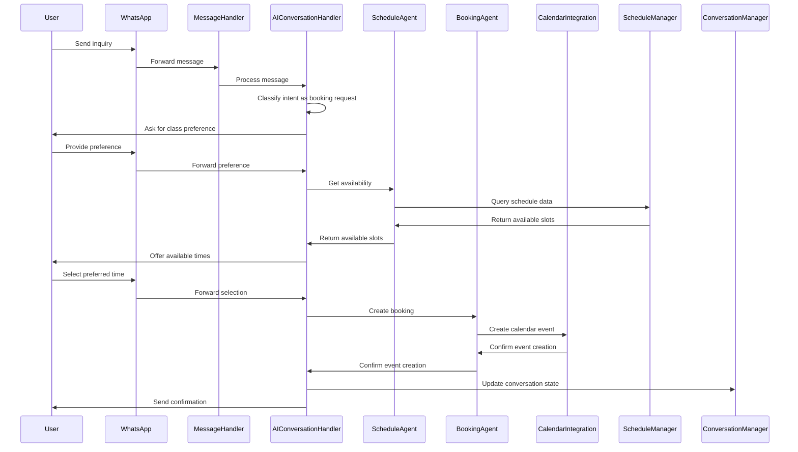
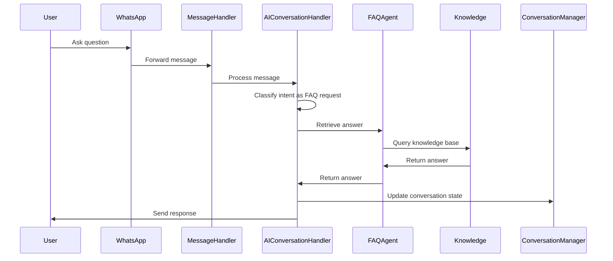

# System Patterns: WhatsApp Chatbot Assistant

## Architectural Overview

The WhatsApp chatbot assistant follows a feature-based architecture with clean separation of concerns. This approach organizes the system around key functional areas while maintaining clear boundaries between components.



## Core Components

### 1. WhatsApp API Integration
- **Responsibility**: Interface with WhatsApp Cloud API
- **Key Functions**:
  - Receive incoming messages
  - Send outgoing messages
  - Handle webhook verification
  - Process message formats (text, buttons, media)
- **Design Pattern**: Adapter Pattern (adapts WhatsApp API to internal message format)

### 2. Message Handler
- **Responsibility**: Process incoming messages and route to appropriate components
- **Key Functions**:
  - Parse message content
  - Maintain conversation context
  - Route messages to the AI Conversation Handler
  - Handle errors and exceptions
- **Design Pattern**: Chain of Responsibility (for message processing pipeline)

### 7. AI Conversation Handler
- **Responsibility**: Understand user intent from message content, manage conversation flow, and coordinate with other components using AI. This component *performs* intent recognition internally and uses Langraph to manage multiple specialized agents. It is not an agent itself, but rather a coordinator of agents.
- **Key Functions**:
  - Identify booking requests
  - Extract class preferences
  - Recognize information requests
  - Handle greetings and common phrases
  - Route messages to appropriate agents (Schedule Agent, Booking Agent, FAQ Agent)
  - Maintain conversation state using Langchain's memory components
- **Design Pattern**: Strategy Pattern (for different recognition approaches), State Pattern (for conversation state management)

### 4. Conversation Manager
- **Responsibility**: Manage conversation flow and state
- **Key Functions**:
  - Track conversation state
  - Determine next steps in conversation
  - Generate appropriate responses
  - Coordinate with other components
- **Design Pattern**: State Pattern (for conversation state management)

### 5. Schedule Manager
- **Responsibility**: Handle class schedule and availability
- **Key Functions**:
  - Read schedule data from CSV
  - Check class availability
  - Reserve slots temporarily
  - Update availability after booking
- **Design Pattern**: Repository Pattern (for data access)

### 6. Calendar Integration
- **Responsibility**: Interface with Google Calendar API
- **Key Functions**:
  - Create calendar events
  - Send invitations to customers
  - Update or cancel events
  - Check for conflicts
- **Design Pattern**: Adapter Pattern (adapts internal booking data to Calendar API)

## AI Agents

### Schedule Agent
- **Responsibility**: Parses schedule requests and checks class availability.
- **Key Functions**:
  - Extracts class types, dates, and times from user requests.
  - Queries the CSV schedule data to check availability.
  - Returns available slots to the AI Conversation Handler.
- **Interaction Pattern**: The AI Conversation Handler invokes this agent when the user asks about class schedules or availability. The agent returns a list of available slots, which the AI Conversation Handler then presents to the user.
- **Implementation Details**:
  - Uses a custom tool to query the CSV schedule data, leveraging the `pandas` library for efficient data access.
  - Implements logic to handle different date and time formats.

### Booking Agent
- **Responsibility**: Handles the specific flow of creating and confirming bookings.
- **Key Functions**:
  - Collects necessary information from the user (e.g., name, contact details).
  - Creates a calendar event using the Google Calendar API.
  - Sends a confirmation message to the user.
- **Interaction Pattern**: The AI Conversation Handler invokes this agent when the user wants to book a class. The agent collects the necessary information, creates a calendar event, and sends a confirmation message to the user.
- **Implementation Details**:
  - Uses a custom tool to interact with the Google Calendar API, authenticating with the appropriate scopes.
  - Implements logic to handle different time zones and calendar settings.

### FAQ Agent
- **Responsibility**: Provides answers to common questions about classes and policies.
- **Key Functions**:
  - Matches user questions to relevant FAQ entries.
  - Returns the answer to the user.
- **Interaction Pattern**: The AI Conversation Handler invokes this agent when the user asks a question that can be answered from the FAQ knowledge base. The agent returns the answer to the user.
- **Implementation Details**:
  - Uses embeddings (e.g., OpenAI embeddings) to match user questions to relevant FAQ entries.
  - Uses a custom tool to retrieve answers from the knowledge base, leveraging a vector database or similar technology for efficient retrieval.

### Main Conversation Agent
- **Responsibility**: Handles core user interaction, intent classification, and conversation flow.
- **Key Functions**:
  - Receives messages from the Message Handler.
  - Classifies user intent using OpenAI.
  - Routes messages to appropriate agents (Schedule Agent, Booking Agent, FAQ Agent).
  - Generates responses to the user.
- **Interaction Pattern**: This agent is the entry point for all user messages. It classifies the user's intent and routes the message to the appropriate agent.
- **Implementation Details**:
  - Uses OpenAI's GPT-4 or GPT-3.5-turbo model for intent classification.
  - Uses Langchain's PromptTemplates to structure consistent AI interactions.
  - Uses Langchain's memory components to maintain conversation context.

### System Coordinator
- **Responsibility**: Manages the flow between agents and maintains overall conversation state.
- **Key Functions**:
  - Receives messages from the AI Conversation Handler.
  - Determines the next agent to be invoked based on the conversation state.
  - Maintains a structured state object that maintains conversation context.
  - Implements a clear handoff protocol between agents to maintain conversation coherence.
- **Interaction Pattern**: This component is responsible for managing the overall conversation flow and ensuring that the agents interact seamlessly. It uses a Langraph graph to define the agent interaction flow.
- **Implementation Details**:
  - Uses Langraph to define the agent interaction flow, defining the possible states and transitions between agents.
  - Maintains a structured state object to track conversation context, including user preferences, booking details, and conversation history.
  - Implements a clear handoff protocol between agents to maintain conversation coherence, ensuring that each agent has the necessary information to continue the conversation.

## Data Flow

### Booking Flow


### Information Request Flow


## Key Technical Decisions

### 1. Stateful Conversation Management
- **Decision**: Maintain conversation state between messages
- **Rationale**: Enables multi-step booking process and context-aware responses
- **Implementation**: State objects stored in memory with persistence for active conversations

### 2. CSV-Based Schedule Management
- **Decision**: Use CSV files for class schedule data
- **Rationale**: Simple to implement, easy for staff to update, and meets initial requirements
- **Implementation**: CSV parser with caching and regular refresh intervals

### 3. Feature-Based Code Organization
- **Decision**: Organize code by feature rather than technical layer
- **Rationale**: Improves maintainability by grouping related functionality
- **Implementation**: Directory structure follows feature boundaries

### 4. Dependency Injection
- **Decision**: Use dependency injection for component coupling
- **Rationale**: Improves testability and flexibility
- **Implementation**: Constructor injection for required dependencies

### 5. Error Handling Strategy
- **Decision**: Centralized error handling with graceful degradation
- **Rationale**: Ensures consistent user experience even when components fail
- **Implementation**: Error middleware that catches exceptions and provides appropriate responses

## Component Relationships

### Primary Dependencies
- Message Handler → AI Conversation Handler
- AI Conversation Handler → Conversation Manager
- Conversation Manager → Schedule Manager → CSV Data Access
- Conversation Manager → Calendar Integration → Google Calendar API

### Secondary Dependencies
- Message Handler → WhatsApp API Integration
- Conversation Manager → Response Templates
- Schedule Manager → Class Definitions

## Critical Implementation Paths

### 1. Message Reception and Processing
```
WhatsApp Webhook → Message Handler → AI Conversation Handler → Conversation Manager → Response Generation → Message Sending
```

### Using Context7 MCP for Documentation
- When implementing new features or modifying existing ones, use the Context7 MCP server to fetch up-to-date documentation and code examples.
- This ensures that the code is accurate and follows the latest best practices.
- Example:
  ```
  1. Identify the relevant library (e.g., pandas for CSV data access).
  2. Use the `resolve-library-id` tool to get the library ID:
     <use_mcp_tool>
     <server_name>github.com/upstash/context7-mcp</server_name>
     <tool_name>resolve-library-id</tool_name>
     <arguments>
     {
       "libraryName": "pandas"
     }
     </arguments>
     </use_mcp_tool>
  3. Use the `get-library-docs` tool to fetch documentation:
     <use_mcp_tool>
     <server_name>github.com/upstash/context7-mcp</server_name>
     <tool_name>get-library-docs</tool_name>
     <arguments>
     {
       "context7CompatibleLibraryID": "/pydata/pandas",
       "topic": "data manipulation"
     }
     </arguments>
     </use_mcp_tool>
  4. Use the fetched documentation to guide the implementation.
  ```

### 2. Availability Checking
```
User Request → Conversation Manager → Schedule Manager → CSV Parser → Availability Logic → Response Formatting
```

### 3. Booking Creation
```
User Confirmation → Conversation Manager → Calendar Integration → Google Calendar API → Confirmation Generation
```

## Revision History
- v1.0 (Initial version): Project initialization
