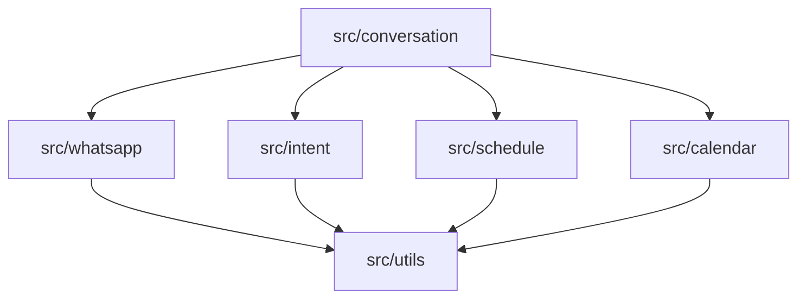

# Technical Context: WhatsApp Chatbot Assistant

## Technology Stack

### Core Technologies
- **Python 3.9+**: Primary programming language
- **WhatsApp Cloud API**: For message sending and receiving
- **Google Calendar API**: For creating and managing calendar events
- **CSV Files**: For storing and retrieving class schedule data
- **pytest**: For unit and integration testing

### Supporting Libraries
- **requests**: HTTP client for API interactions
- **python-dotenv**: Environment variable management
- **pandas**: Data manipulation for CSV processing
- **google-auth**: Authentication for Google Calendar API
- **google-api-python-client**: Client library for Google APIs
- **pytest-mock**: Mocking framework for testing
- **pytest-cov**: Test coverage reporting
- **langchain**: Framework for building AI applications
- **openai**: OpenAI API for natural language understanding
- **langgraph**: Framework for building multi-agent systems
- **tiktoken**: For token counting

## Development Environment

### Required Tools
- **Python 3.9+**: Core language runtime
- **pip**: Package management
- **venv**: Virtual environment management
- **git**: Version control
- **VSCode** (recommended): IDE with Python extensions

### Setup Process
1. Clone repository
2. Create virtual environment: `python -m venv venv`
3. Activate virtual environment:
   - Windows: `venv\Scripts\activate`
   - Unix/MacOS: `source venv/bin/activate`
4. Install dependencies: `pip install -r requirements.txt`
5. Set up environment variables (see Configuration section)
6. Run tests to verify setup: `pytest`

## Configuration Management

### Environment Variables
```
# WhatsApp Cloud API
WHATSAPP_API_TOKEN=your_token_here
WHATSAPP_PHONE_NUMBER_ID=your_phone_number_id
WHATSAPP_VERIFY_TOKEN=your_verify_token

# Google Calendar API
GOOGLE_APPLICATION_CREDENTIALS=path_to_credentials.json
CALENDAR_ID=your_calendar_id

# Application Settings
LOG_LEVEL=INFO
DEBUG_MODE=False
```

### Configuration Files
- **.env**: Local environment variables (not committed to version control)
- **config.py**: Configuration loading and validation
- **credentials.json**: Google API credentials file (not committed to version control)
- **schedule.csv**: Class schedule data

## External Dependencies

### WhatsApp Cloud API
- **Documentation**: [WhatsApp Business Platform](https://developers.facebook.com/docs/whatsapp/cloud-api)
- **Rate Limits**: 80 messages per second per WhatsApp Business Account
- **Authentication**: Bearer token authentication
- **Webhook**: Required for receiving messages

### Google Calendar API
- **Documentation**: [Google Calendar API](https://developers.google.com/calendar)
- **Rate Limits**: 1,000,000 queries/day (free tier)
- **Authentication**: OAuth 2.0 or Service Account
- **Scopes Required**: 
  - `https://www.googleapis.com/auth/calendar.events`
  - `https://www.googleapis.com/auth/calendar`

## Technical Constraints

### Performance Constraints
- **Response Time**: < 5 seconds for any user interaction
- **Throughput**: Support for up to 100 concurrent users
- **Availability**: 99.9% uptime target

### Security Constraints
- **Data Protection**: No PII stored beyond what's needed for booking
- **API Security**: Secure storage of API keys and tokens
- **Input Validation**: All user inputs validated before processing

### Operational Constraints
- **Deployment**: Initially deployed on single server
- **Monitoring**: Basic logging and error reporting
- **Backup**: Daily backup of conversation and booking data

## Code Organization

### Directory Structure
```
whatsapp-gym-bot/
├── src/
│   ├── whatsapp/           # WhatsApp integration
│   ├── intent/             # Intent recognition
│   ├── conversation/       # Conversation management
│   ├── schedule/           # Schedule management
│   ├── calendar/           # Calendar integration
│   └── utils/              # Shared utilities
├── tests/                  # Test suite
├── config/                 # Configuration files
├── data/                   # Data files (CSV)
├── docs/                   # Documentation
└── scripts/                # Utility scripts
```

### Module Dependencies


## Testing Strategy

### Test Types
- **Unit Tests**: For individual components and functions
- **Integration Tests**: For component interactions
- **Mock Tests**: For external API interactions
- **End-to-End Tests**: For complete conversation flows

### Test Coverage Targets
- **Core Logic**: 90%+ coverage
- **API Integrations**: 80%+ coverage
- **Utility Functions**: 70%+ coverage

### Testing Tools
- **pytest**: Test framework
- **pytest-mock**: Mocking external dependencies
- **pytest-cov**: Coverage reporting
- **pytest-asyncio**: Testing async code (if needed)

## AI Technologies
- **Langchain**: Framework for building AI applications
- **OpenAI**: OpenAI API for natural language understanding
- **Langgraph**: Framework for building multi-agent systems
- **tiktoken**: For token counting

## Code Organization

Add the following to the directory structure:

```
whatsapp-gym-bot/
├── src/
│   ├── ai/
│   │   ├── agents/
│   │   ├── tools/
│   │   ├── memory/
│   │   ├── prompts/
│   │   ├── models/
│   │   └── conversation/
```

## Deployment Strategy

### Initial Deployment
- **Environment**: Single server deployment
- **Process**: Manual deployment with documented steps
- **Monitoring**: Basic logging to files

### Future Considerations
- **Containerization**: Docker for consistent environments
- **CI/CD**: Automated testing and deployment
- **Scaling**: Horizontal scaling for increased load

## Tool Usage Patterns

### Development Workflow
1. Feature branch creation
2. Local development and testing
3. Pull request with test coverage
4. Code review
5. Merge to main branch

### Context7 MCP Server
- The Context7 MCP server is now available for fetching up-to-date documentation and code examples for various libraries.
- To use it, first resolve the library ID using the `resolve-library-id` tool:
  ```
  <use_mcp_tool>
  <server_name>github.com/upstash/context7-mcp</server_name>
  <tool_name>resolve-library-id</tool_name>
  <arguments>
  {
    "libraryName": "library_name"
  }
  </arguments>
  </use_mcp_tool>
  ```
- Then, use the `get-library-docs` tool to fetch the documentation:
  ```
  <use_mcp_tool>
  <server_name>github.com/upstash/context7-mcp</server_name>
  <tool_name>get-library-docs</tool_name>
  <arguments>
  {
    "context7CompatibleLibraryID": "library_id",
    "topic": "optional_topic"
  }
  </arguments>
  </use_mcp_tool>
  ```
- Use the fetched documentation to implement features and ensure code accuracy.

### Debugging Approach
1. Logging at appropriate levels
2. Structured error handling
3. Traceability through components
4. Isolated component testing

## Revision History
- v1.0 (Initial version): Project initialization
